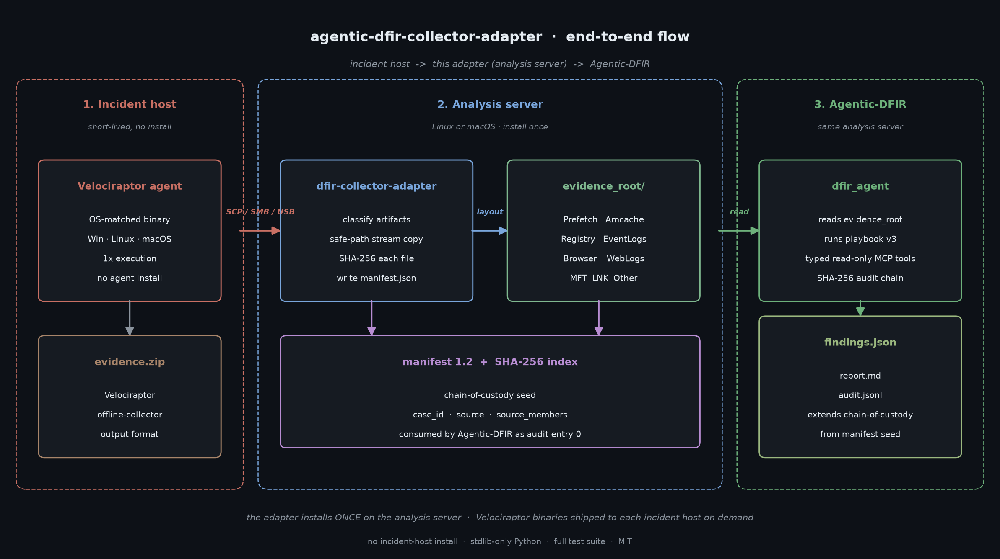
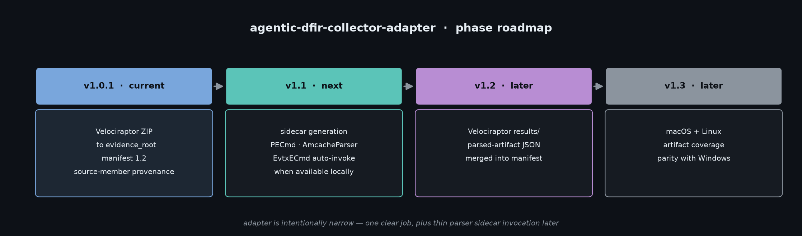

# agentic-dfir-collector-adapter

[](https://github.com/Juwon1405/agentic-dfir-collector-adapter/actions/workflows/tests.yml)
[](https://www.python.org/)
[](LICENSE)
[](https://github.com/Juwon1405/agentic-dfir#phase-1-rollout-roadmap)
[](https://github.com/Juwon1405/agentic-dfir)

> **A thin Python layer that turns Velociraptor offline-collector output into the `evidence_root` layout expected by [Agentic-DFIR](https://github.com/Juwon1405/agentic-dfir).**
>
> No fork of Velociraptor. No re-implementation of forensic collection. Just the missing piece between *what an industry-standard collector emits* and *what an agentic DFIR analysis engine wants to read*.

---

## Architecture



The adapter installs **once** on the analysis server. It is **not** installed on incident hosts. Each incident host receives a Velociraptor agent binary for its OS / arch (Windows / Linux / macOS), runs it once to produce `evidence.zip`, and ships the ZIP back. The adapter then performs the layout translation that Agentic-DFIR expects.

---

## Position in the Agentic-DFIR roadmap

This repository is **Phase 1.3** of the [Agentic-DFIR rollout roadmap](https://github.com/Juwon1405/agentic-dfir#phase-1-rollout-roadmap) — the *collector adapter* deliverable. It exists so the upstream collection layer (Velociraptor) and the upstream analysis engine (Agentic-DFIR) can stay independent of each other.

| Concern                  | Where it lives                                                                                                       |
|--------------------------|----------------------------------------------------------------------------------------------------------------------|
| **Collection** on hosts  | [Velociraptor](https://docs.velociraptor.app/) agent (binary, runs on the endpoint)                                  |
| **Layout normalization** | **This repo** *(Phase 1.3, current)*                                                                                 |
| **Analysis & reasoning** | [Agentic-DFIR](https://github.com/Juwon1405/agentic-dfir) (runs on the same analysis server)                         |
| **Chain-of-custody**     | This adapter seeds it (`manifest.json` + SHA-256 index); Agentic-DFIR continues it as `audit.jsonl` entry 1 onwards. |

---

## Why this exists

[Velociraptor](https://docs.velociraptor.app/) is an excellent open-source IR collector with cross-platform agents (Windows / Linux / macOS) and a huge artifact library (`Windows.KapeFiles.Targets`, `Windows.Forensics.Lnkfiles`, `MacOS.Forensics.*`, `Linux.Forensics.*`).

[Agentic-DFIR](https://github.com/Juwon1405/agentic-dfir) is an autonomous DFIR analysis engine that consumes a flat, well-named `evidence_root/` directory:

```
evidence_root/
├── manifest.json
├── Prefetch/         SVCHOST.EXE-XYZ.pf, ...
├── Amcache/          Amcache.hve
├── Registry/         SOFTWARE, SYSTEM, SAM, ...
├── EventLogs/        Security.evtx, ...
├── Browser/          History, places.sqlite, ...
├── WebLogs/          access.log, u_ex240509.log, ...
├── AuthLogs/         auth.log, secure
├── Memory/           memory.dmp
├── LNK/              *.lnk
├── JumpLists/        *.automaticDestinations-ms
├── MFT/              $MFT
├── USNJournal/       $UsnJrnl-$J
├── PowerShell/       ConsoleHost_history.txt
└── Other/            (anything unrecognized)
```

Velociraptor's offline-collector ZIPs do **not** look like that. Members are paths like `uploads/auto/C:/Windows/System32/winevt/Logs/Security.evtx`, mixed with `results/*.json` and per-artifact subtrees.

This adapter is the **glue**:

```
Velociraptor offline ZIP  ─▶  dfir-collector-adapter  ─▶  evidence_root/
                                                          (Agentic-DFIR reads this)
```

It is stdlib-only by design (no third-party Python packages), and small enough to audit in one sitting.

### Positioning vs. commercial EDR collection (Falcon Forensics, Tanium)

This adapter **complements — does not compete with** — commercial
EDR-based ad-hoc collection (CrowdStrike Falcon Forensics, Tanium
Threat Response, etc.).

Commercial agent-based collection covers the **80% case**: hosts that
already run the vendor agent, where the IR team can push a collection
job from the central console and pull a curated artefact bundle back
in minutes. That is the right tool for that scenario.

This adapter covers the remaining **20%** — the cases that determine
how bad an incident gets:

- **No agent installed.** Third-party / partner / contractor endpoints,
  BYOD devices, legacy servers, isolated lab networks, build systems.
- **Agent installed but ineffective.** Compromised hosts where the
  attacker disabled or tampered with the EDR agent before triage.
- **Raw disk image acquisitions.** DD / E01 / AFF / VMDK images
  handed over by a client or seized for analysis — the host is gone,
  the image is all there is.
- **Emergency triage.** Need to acquire from an unmanaged host in
  the next thirty minutes, no time to deploy and license an agent.
- **Sensitive cases.** Investigations where pushing a job through the
  central commercial console is itself a leak risk.

Velociraptor's offline collector is a **single binary, no install, no
network call**. Drop it on a USB, run it, get the ZIP, hand it to this
adapter, and Agentic-DFIR sees the same `evidence_root` layout it sees
from any other source.

Agentic-DFIR intentionally consumes **both** channels through the same
`evidence_root` contract. The analysis engine does not care which
collector produced the data, and the organization is not coupled to a
single commercial vendor's collection format.

---

## Install

The analysis server runs on Linux or macOS. There are two install scripts,
for two different jobs:

**`scripts/install.sh`** — set up the adapter on *this* analyst machine.
Installs the Python adapter (`dfir-collector-adapter`) and downloads the one
Velociraptor binary that matches the current host's OS/arch, verifying it
against the upstream `sha256sums` manifest.

```bash
git clone https://github.com/Juwon1405/agentic-dfir-collector-adapter
cd agentic-dfir-collector-adapter
bash scripts/install.sh
```

Pin a specific Velociraptor version, choose an install dir, or skip the
binary entirely:

```bash
bash scripts/install.sh --version 0.74.0
bash scripts/install.sh --install-dir /opt/dfir/bin
bash scripts/install.sh --no-velociraptor      # adapter only
```

**`scripts/fetch-responder-binaries.sh`** — stage Velociraptor binaries for
*every* common OS/arch into `./bin/velociraptor/`, so responders can ship the
right binary to any Windows/Linux/macOS incident host without leaving the
analysis server. Run this only when you need the multi-platform set.

```bash
bash scripts/fetch-responder-binaries.sh
VELO_VERSION=0.74.0 bash scripts/fetch-responder-binaries.sh   # pin version
bash scripts/fetch-responder-binaries.sh --no-velociraptor     # adapter only
```

Manual install of just the adapter (no Velociraptor at all):

```bash
pip install -e .
```

---

## Usage

### 1. On the incident host — collect

Ship the Velociraptor binary that matches the **incident host's OS/arch**
(`scripts/fetch-responder-binaries.sh` stages all six under
`./bin/velociraptor/`). Copy the ONE that matches the host:

```bash
# from the analysis server — pick the binary for the host you are collecting from
# Windows:
scp ./bin/velociraptor/velociraptor-windows-amd64 responder@host:C:/temp/velociraptor.exe
# Linux:
scp ./bin/velociraptor/velociraptor-linux-amd64   responder@host:/tmp/velociraptor
# macOS (Apple silicon; use velociraptor-darwin-amd64 on Intel Macs):
scp ./bin/velociraptor/velociraptor-darwin-arm64  responder@host:/tmp/velociraptor
```

Run an offline collector on the host (one-time execution, no agent install):

```cmd
:: on a Windows incident host
C:\temp\velociraptor.exe -i artifacts collect Windows.KapeFiles.Targets ^
    --output C:\temp\evidence.zip
```

```bash
# on a Linux / macOS incident host (chmod once, then run)
chmod +x /tmp/velociraptor
/tmp/velociraptor -i artifacts collect Linux.Search.FileFinder \
    --output /tmp/evidence.zip
```

Copy `evidence.zip` back to the analysis server.

### 2. On the analysis server — adapt

The adapter accepts two source kinds via `--source`:

| `--source` | Input | Pipeline |
| ---------- | ----- | -------- |
| `zip` (default) | Velociraptor offline-collector ZIP | direct extraction into `evidence_root/` |
| `image` | Raw forensic disk image (`.dd`/`.raw`/`.E01`) | Velociraptor dead-disk remapping → collection ZIP → same extraction |

```bash
# (a) offline-collector ZIP — the default
python3 -m dfir_collector_adapter --source zip \
    --input /tmp/evidence.zip \
    --output /evidence/case-2026-001/ \
    --case-id case-2026-001
```

```bash
# (b) raw disk image — Velociraptor processes the image, the adapter
#     converts the resulting collection into the same evidence_root layout
python3 -m dfir_collector_adapter --source image \
    --input /evidence/disk.E01 \
    --output /evidence/case-2026-001/ \
    --case-id case-2026-001 \
    --velociraptor-bin ./bin/velociraptor   # optional; see resolution order
```

**Velociraptor binary resolution** (`--source image`), first hit wins:
`--velociraptor-bin` → `DFIR_VELOCIRAPTOR_BIN` → staged `./bin/` →
`velociraptor` on `PATH`. If none resolves, the run fails fast with an
actionable message and a non-zero exit code (it never pretends the image was
processed).

**Image-source limitation (read this).** Velociraptor does not ingest a raw
image directly; the `image` path generates a documented *remapping* config
that exposes the image to Velociraptor's NTFS accessor, then runs an ordinary
`artifacts collect`. The exact artifact name and accessor flags are
release-specific — verify them against your Velociraptor version, or override
with `--artifact`. Intermediate files live in a temp directory that is removed
after the run unless `--keep-temp` is given. If dead-disk remapping is
unsupported on your build, prepare the collection ZIP yourself and use
`--source zip` instead. This path is covered by mocked end-to-end tests
(image → collection ZIP → `manifest.json`); it has **not** been exercised
against a live Velociraptor binary in CI.

Output:

```json
{
  "bytes_copied": 12483920,
  "case_id": "case-2026-001",
  "categories": {
    "amcache": 1,
    "browser": 4,
    "eventlog": 7,
    "prefetch": 156,
    "registry": 6
  },
  "files_copied": 174,
  "files_skipped": 0,
  "output_root": "/evidence/case-2026-001",
  "source_sha256": "44e8c1..."
}
```

### CLI flags and exit codes

Beyond the source/input/output flags shown above, the adapter accepts:

- `--overwrite` — replace an existing `manifest.json` (known layout
  subdirectories are cleared first so stale evidence cannot contaminate the
  new manifest).
- `--no-hash-index` — skip the per-file SHA-256 index in `manifest.json`
  (faster, but downstream integrity verification is weaker).
- `--quiet` / `-q` — suppress the JSON summary on stdout.
- `--keep-temp` — (`--source image` only) retain the intermediate temp dir.

Exit codes are stable and scriptable:

| Code | Meaning |
|------|---------|
| `0` | success |
| `1` | unexpected error |
| `2` | input not found |
| `3` | `manifest.json` already exists (use `--overwrite`) |
| `4` | malformed ZIP |
| `5` | Velociraptor binary not found (`--source image`) |
| `6` | image extraction failed (`--source image`) |

### 3. Hand off to Agentic-DFIR

The adapter writes `evidence_root/manifest.json`; Agentic-DFIR consumes that
layout. For a real investigation, point its `run_eval.py` at the
`evidence_root/` this adapter produced:

```bash
# in the agentic-dfir repo, after authenticating (export ANTHROPIC_API_KEY=...)
python3 run_eval.py --evidence /evidence/case-2026-001/ --case-id case-2026-001 --max-iterations 25
```

(`run_eval.py --case <tier>/case-NN` is for the repo's bundled benchmark
cases; `--evidence <path>` is the real-evidence entry point.)

Agentic-DFIR reads `manifest.json` as the chain-of-custody seed and writes its
own `audit.jsonl` to continue the chain. The adapter and Agentic-DFIR are kept
in **separate repositories** on purpose: collection/normalisation (this repo,
no API key, no LLM) is independent of analysis (Agentic-DFIR, LLM-driven), so
the trust boundary between "what was collected" and "what was concluded" is
explicit and auditable.

---

## Programmatic API

```python
from dfir_collector_adapter import adapt

result = adapt(
    velociraptor_zip="/tmp/evidence.zip",
    output_evidence_root="/evidence/case-2026-001/",
    case_id="case-2026-001",
)

print(result.files_copied, result.bytes_copied, result.categories)
```

Returns an `AdapterResult` dataclass:

```python
@dataclass
class AdapterResult:
    output_root: Path
    case_id: str
    files_copied: int
    files_skipped: int
    bytes_copied: int
    categories: dict[str, int]
    skipped_paths: list[str]
    source_members: dict[str, str]
    source_sha256: str | None
```

---

## What the adapter actually does

| Step | What                                                                                                  |
|------|-------------------------------------------------------------------------------------------------------|
| 1    | Open the Velociraptor ZIP and iterate every file member.                                              |
| 2    | Classify each member by name (`.pf` → Prefetch, `Amcache.hve` → Amcache, `*.evtx` → EventLogs, ...).  |
| 3    | Validate the basename — reject control bytes, traversal characters, and anything that resolves outside the evidence_root. |
| 4    | Stream-copy into `evidence_root/<Category>/<basename>` (preserves binary content, never modifies). If two source members collapse to the same flat filename, the later copy receives a short content-independent source-path digest suffix instead of overwriting the earlier one. |
| 5    | After all files copied, walk the output and SHA-256 every file (1 MiB streaming, no full-file load).  |
| 6    | Write `manifest.json` last so a half-finished run never looks successful.                             |

### Refused inputs

The adapter is opinionated about what it *won't* do, to keep its security surface tiny:

- Files larger than 10 GiB are skipped (`max_bytes_per_file`, configurable).
- Cumulative extracted bytes are capped at 50 GiB (`max_total_bytes`, configurable) to defend against many-small-files zip-bomb shapes.
- The per-file cap is enforced against bytes *actually read* — the ZIP header's `file_size` is treated as untrusted.
- ZIP members whose POSIX mode marks them as symbolic links are skipped.
- ZIP members with control characters in the name are skipped.
- ZIP members whose path would resolve outside `evidence_root` are skipped.
- Existing `evidence_root` with a manifest is not overwritten (use `--overwrite`; when used, known layout subdirectories are cleared first so stale evidence cannot contaminate the new manifest).

Skipped paths are reported in `AdapterResult.skipped_paths` **and** persisted under `skipped` in `manifest.json` for chain-of-custody.

Collision-renamed files are mapped back to their original ZIP member path under
`manifest.json` -> `source_members`, so downstream tools can preserve provenance
without giving up the flat `evidence_root` layout.

---

## Layout / classification reference

See [`src/dfir_collector_adapter/layout.py`](src/dfir_collector_adapter/layout.py) for the authoritative classifier. High-level mapping:

| Velociraptor member pattern                                | Goes into             |
|------------------------------------------------------------|-----------------------|
| `*.pf`                                                     | `Prefetch/`           |
| `Amcache.hve`                                              | `Amcache/`            |
| `SECURITY`, `SAM`, `SOFTWARE`, `SYSTEM`, `DEFAULT`, `NTUSER.DAT`, `UsrClass.dat`, `Shellbags` | `Registry/`  |
| `*.evtx`, `*.evt`                                          | `EventLogs/`          |
| Chrome / Edge / Firefox / Safari / Brave / Opera / Chromium `History`, Cookies, Cache | `Browser/` |
| `places.sqlite`                                            | `Browser/`            |
| `$MFT`                                                     | `MFT/`                |
| `$UsnJrnl`                                                 | `USNJournal/`         |
| `access*.log`, `nginx/*.log`, `u_ex*.log` (IIS)            | `WebLogs/`            |
| `auth.log`, `secure`, `wtmp`, `btmp`, `lastlog` (+ rotated `.N` / `.gz`) | `AuthLogs/`           |
| `*.mem`, `*.dmp`, `*.vmem`, `*.raw`                        | `Memory/`             |
| `*.lnk`                                                    | `LNK/`                |
| `*.automaticDestinations-ms`, `*.customDestinations-ms`    | `JumpLists/`          |
| `ConsoleHost_history.txt`                                  | `PowerShell/`         |
| (everything else)                                          | `Other/`              |

---

## `manifest.json`

Written under `evidence_root/manifest.json`:

```json
{
  "manifest_version": "1.2",
  "case_id": "case-2026-001",
  "generated_at": "2026-05-13T15:00:00+00:00",
  "source": {
    "zip": "/tmp/evidence.zip",
    "sha256": "44e8c1...",
    "type": "velociraptor_offline_collector"
  },
  "host": {
    "os": "Linux",
    "release": "5.15.0-...",
    "python": "3.12.1"
  },
  "adapter": {
    "name": "agentic-dfir-collector-adapter",
    "version": "2.0.0"
  },
  "counters": {
    "files_copied": 174,
    "bytes_copied": 12483920,
    "files_skipped": 0
  },
  "categories": {
    "prefetch": 156,
    "amcache": 1,
    "registry": 6,
    "eventlog": 7,
    "browser": 4
  },
  "skipped": [],
  "source_members": {
    "Prefetch/SVCHOST.EXE-ABC.pf": "uploads/auto/C:/Windows/Prefetch/SVCHOST.EXE-ABC.pf",
    "Browser/History": "uploads/auto/C:/Users/alice/AppData/Local/Google/Chrome/User Data/Default/History",
    "Browser/History-7e9a1c2d3b4f": "uploads/auto/C:/Users/bob/AppData/Local/Google/Chrome/User Data/Default/History"
  },
  "sha256_index": {
    "Prefetch/SVCHOST.EXE-ABC.pf": "9d7f...",
    "Amcache/Amcache.hve": "3c8e...",
    "Browser/History": "8d41...",
    "Browser/History-7e9a1c2d3b4f": "b7a0..."
  }
}
```

> Manifest schema is at `1.2`: `source.sha256` anchors the input ZIP,
> `skipped` records refused inputs, and `source_members` preserves provenance
> for flattened or collision-renamed output files alongside the SHA-256 index.

---

## Why not just fork Velociraptor?

Because forking 100k+ lines of Go to add one Python adapter would be insane.

- Velociraptor releases patches every few weeks. Tracking those in a fork is a full-time job.
- Adapter design = ~500 LOC of Python. Fork design = thousands of LOC of Go you don't own.
- This way, responders use **upstream Velociraptor releases** and pin the version via `VELO_VERSION` (or `--version`) in the install scripts. Security patches arrive on day zero.

---

## Phase roadmap



| Phase     | Status   | Scope                                                                                            |
|-----------|----------|--------------------------------------------------------------------------------------------------|
| **v2.0.0** | current  | Renamed to agentic-dfir-collector-adapter alongside Agentic-DFIR: package `dfir_collector_adapter`, CLI `dfir-collector-adapter`, env `DFIR_VELOCIRAPTOR_BIN`. No behaviour change. |
| **v1.0.1** | shipped  | Velociraptor ZIP → evidence_root with SHA-256 manifest 1.2; hardened integrity (input-ZIP SHA-256 anchor, persisted skip log, collision-safe source-member provenance, overwrite-safe), ZIP-bomb + symlink defenses, single-pass hashing, mtime preservation, install-time binary checksum verification. Full test suite passing locally on Python 3.11. |
| **v1.1**  | next     | Sidecar generation — auto-invoke `PECmd`, `AmcacheParser`, `EvtxECmd` when present locally.       |
| **v1.2**  | later    | Ingest Velociraptor `results/*.json` (parsed-artifact JSON) and merge into the manifest.          |
| **v1.3**  | later    | macOS + Linux artifact coverage parity with Windows.                                              |

The adapter is intentionally narrow. It will not grow into a "platform."

---

## Companion

**[agentic-dfir](https://github.com/Juwon1405/agentic-dfir)** — the analysis engine this adapter feeds.

---

## License

MIT. See [LICENSE](LICENSE).

## Author

**YuShin** (優心 / Bang Juwon) — DFIR practitioner, Tokyo.

> *"One small adapter. One large saved hour per incident."*
